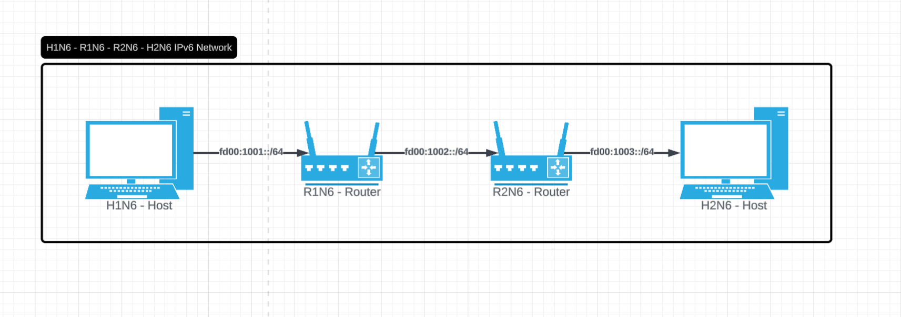
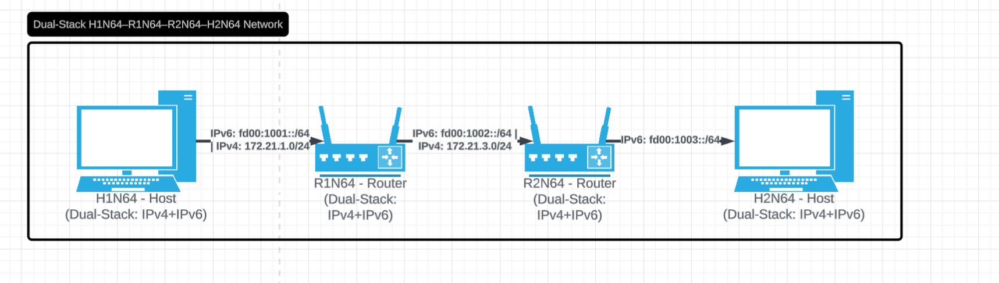
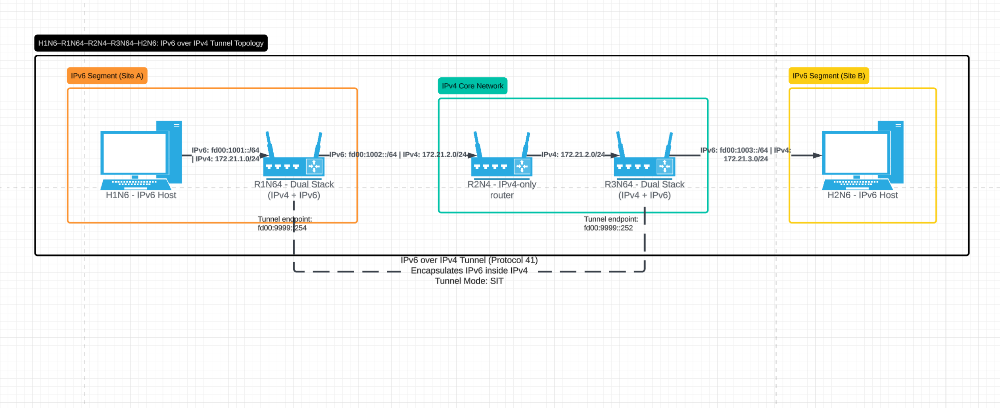

# IPv6 Networking Lab with Docker

## Overview
This project demonstrates the implementation and analysis of three networking environments using Docker:

- IPv6-only network  
- Dual Stack network (IPv4 + IPv6)  
- IPv6 over IPv4 tunneling (Protocol 41)  

The goal of this lab was to understand how IPv6 communication works across different network configurations and how tunneling allows IPv6 traffic to traverse IPv4 infrastructure.

---

## What I Did

- Deployed multiple Docker-based network topologies using provided `.yml` files  
- Verified connectivity using `ping`, `ping6`, and `curl`  
- Inspected routing tables using `ip route` and `ip -6 route`  
- Captured live network traffic using `tcpdump`  
- Analyzed how IPv6 packets are encapsulated inside IPv4 packets  

---

## Network Topologies

### IPv6-Only Network


**Observation:**
- Devices communicated using only IPv6 addresses  
- Routing required proper IPv6 configuration across routers  

---

### Dual Stack Network (IPv4 + IPv6)


**Observation:**
- Devices successfully communicated using both IPv4 and IPv6  
- The protocol used depended on whether `ping` or `ping6` was executed  

---

### IPv6 over IPv4 Tunnel


**Observation:**
- IPv6 traffic successfully traversed an IPv4-only network  
- Tunnel endpoints on dual-stack routers enabled communication  

---

## Connectivity Testing

### IPv6 Ping Across Tunnel

```bash
docker exec H1N6 ping -c2 fd00:1003::5
